class: inverse, middle

```{R, setup, include = F}
# devtools::install_github("dill/emoGG")
library(pacman)
p_load(
  broom, tidyverse,
  latex2exp, ggplot2, ggthemes, ggforce, viridis, extrafont, gridExtra,
  kableExtra, snakecase, janitor,
  data.table, dplyr, estimatr,
  lubridate, knitr, parallel,
  lfe,
  here, magrittr
)
# Define pink color
red_pink <- "#e64173"
turquoise <- "#20B2AA"
orange <- "#FFA500"
red <- "#fb6107"
blue <- "#3b3b9a"
green <- "#8bb174"
grey_light <- "grey70"
grey_mid <- "grey50"
grey_dark <- "grey20"
purple <- "#6A5ACD"
slate <- "#314f4f"
# Dark slate grey: #314f4f
# Knitr options
opts_chunk$set(
  comment = "#>",
  fig.align = "center",
  fig.height = 7,
  fig.width = 10.5,
  warning = F,
  message = F
)
opts_chunk$set(dev = "svg")
options(device = function(file, width, height) {
  svg(tempfile(), width = width, height = height)
})
options(knitr.table.format = "html")
```

# Prologue

---
name: schedule

# Schedule

## Last time

Working with data in .mono[R]—especially via `dplyr`.

## Today

1. .mono[RStudio] basics
2. Getting data in and out of .mono[R].

---
name: review

# Review

Key points from the last lab(s).

1. `dplyr` is your data-work friend.

2. Pipes (`%>%`) make your life easier..super[.pink[†]]

.footnote[.pink[†] Check out `magrittr` for more pipe options, _e.g._, `%<>%`.]
---
layout: false
class: inverse, middle
# RStudio

---
name: features
class: clear

Let's recap some of the major features in .mono[RStudio]...

```{R, pic_rstudio, echo = F}
knitr::include_graphics("RStudio/rstudio.png")
```
---
class: clear

First, you write your .mono[R] scripts (source code) in the .hi[Source] pane.

```{R, pic_rstudio_source1, echo = F}
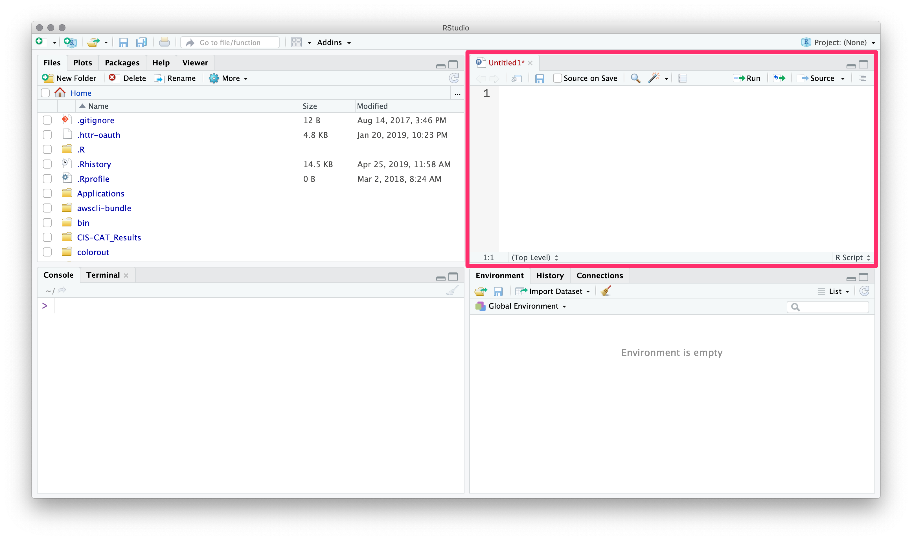
```
---
class: clear

You can use the menubar or .mono[⇧+⌘+N] to create new .mono[R] scripts.

```{R, pic_rstudio_source2, echo = F}
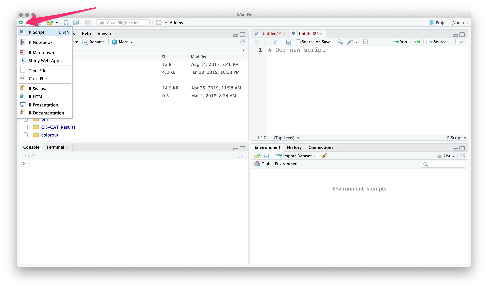
```
---
class: clear

To execute commands from your .mono[R] script, use .mono[⌘+Enter].

```{R, pic_rstudio_source3, echo = F}
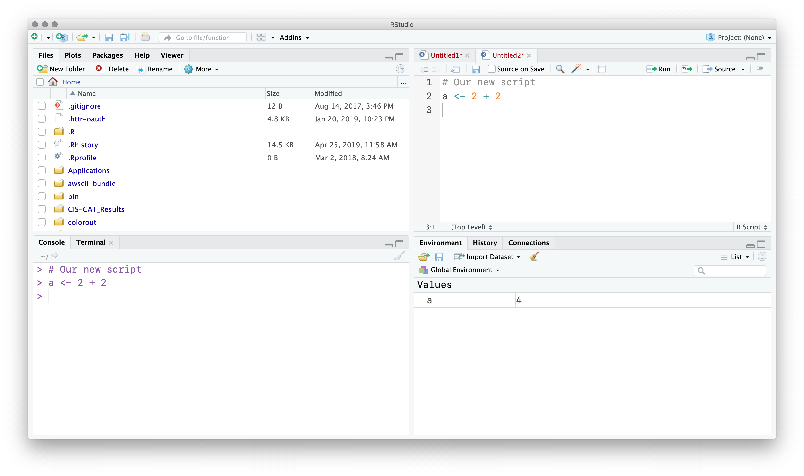
```
---
class: clear

.mono[RStudio] will execute the command in the terminal.

```{R, pic_rstudio_source4, echo = F}
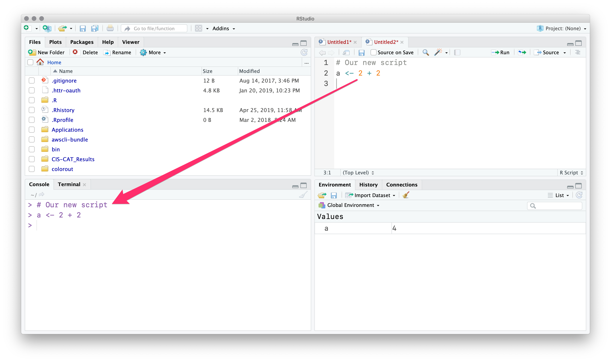
```
---
class: clear

You can see our new object in the .hi[Environment] pane.

```{R, pic_rstudio_source5, echo = F}
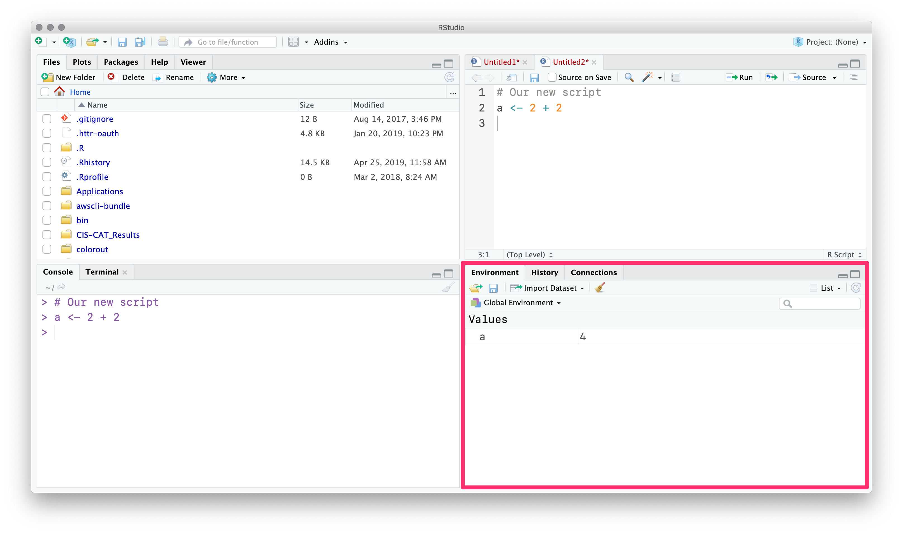
```
---
class: clear

The .hi-purple[History] tab (next to .hi[Environment]) records your old commands.

```{R, pic_rstudio_history, echo = F}
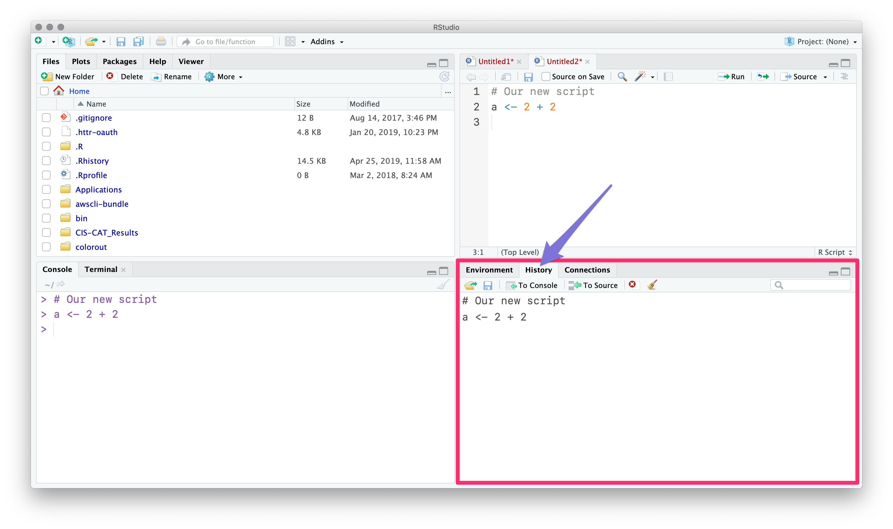
```
---
class: clear

The .hi[Files] pane is file explorer.

```{R, pic_rstudio_files, echo = F}
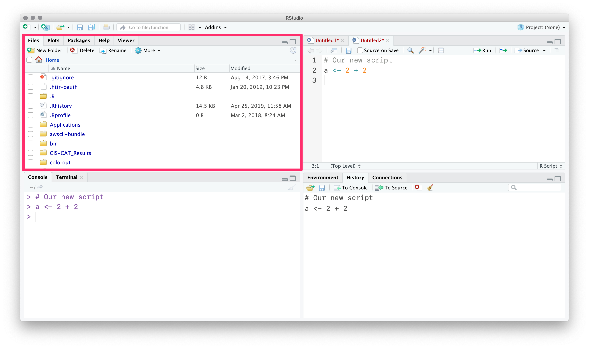
```
---
class: clear

The .hi[Plots] pane/tab shows... plots.

```{R, pic_rstudio_plots, echo = F}
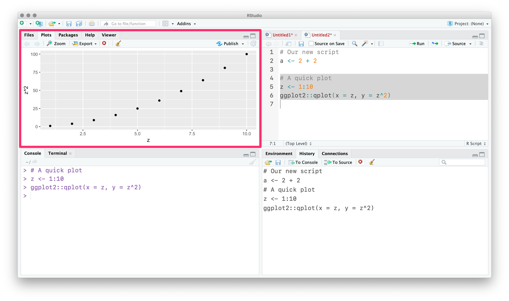
```
---
class: clear

.hi[Packages] shows installed packages

```{R, pic_rstudio_packages, echo = F}
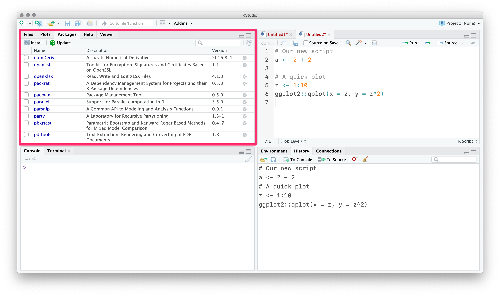
```
---
count: false
class: clear

.hi[Packages] shows installed packages and whether they are .hi-purple[loaded].

```{R, pic_rstudio_packages2, echo = F}
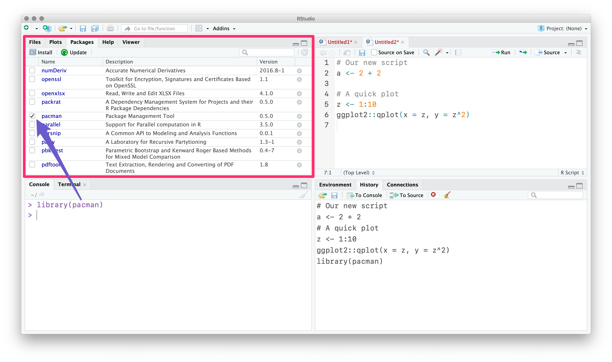
```
---
class: clear

The .hi[Help] tab shows help documentation (also accessible via `?`).

```{R, pic_rstudio_help, echo = F}
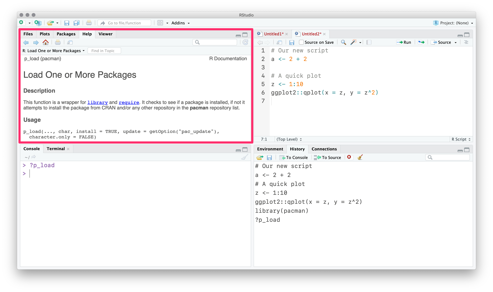
```
---
class: clear

Finally, you can customize the actual layout

```{R, pic_rstudio_layout, echo = F}
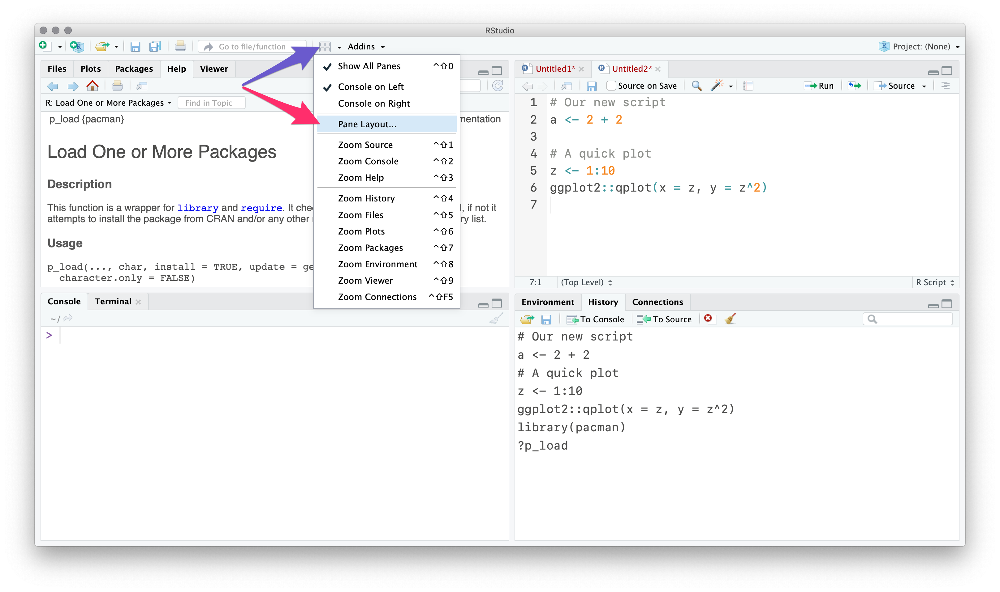
```
---
count: false
class: clear

Finally, you can customize the actual layout and many other items.

```{R, pic_rstudio_customize, echo = F}
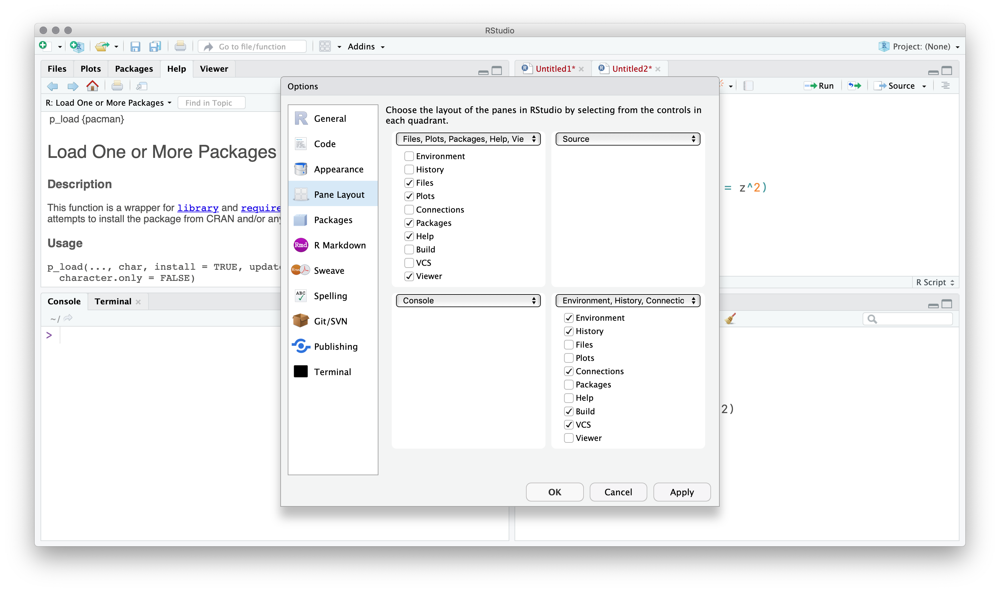
```
---
name: best

# .mono[R] and .mono[RStudio]
## Best practices

1. Write code in .mono[R] scripts. Troubleshoot in .mono[RStudio]. Then run the scripts.

1. Comment your code. (`# This is a comment`)

1. Name objects and variables with intelligible, standardized names.
  - .hi-purple[BAD] `ALLCARS`, `Vl123a8`, `a.fun`, `cens.12931`, `cens.12933`
  - .hi-pink[GOOD] `unique_cars`, `health_df`, `sim_fun`, `is_female`, `age`

1. Set seeds when generating randomness, _e.g._, `set.seed(123)`.

1. Parallelize when possible. (Packages: `parallel`, `purrr`, `foreach`, *etc.*)

1. Use projects in .mono[RStudio] (next). And organize your projects.

---
layout: true
# .mono[R] and .mono[RStudio]
## Projects

---
name: projects

Projects in .mono[R] offer several benefits:

1. Act as an anchor for working with files.

1. Make your work (projects) easily reproducible..super[.pink[†]]

1. Help you quickly jump back into your work.

.footnote[.pink[†] In this class, we're assuming reproducibility is good/desirable.]

---
layout: false
class: clear

To start a new project, hit the .hi[project icon].

```{R, pic_rstudio_projects, echo = F}
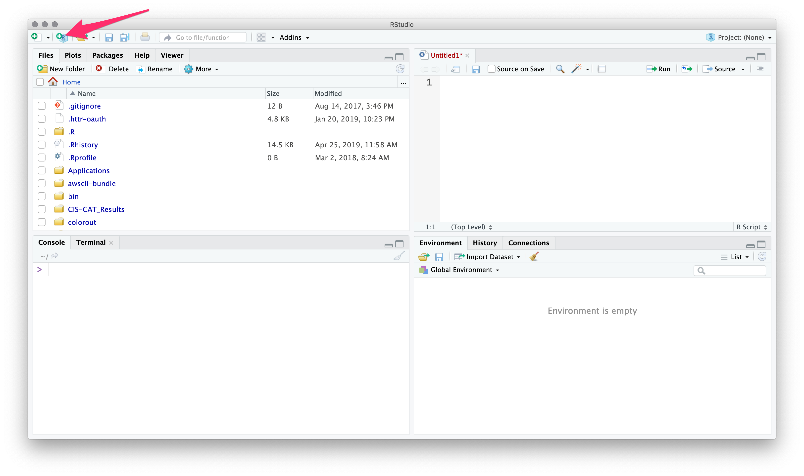
```
---
class: clear

You'll then choose the folder/directory where your project lives.

```{R, pic_rstudio_projects2, echo = F}
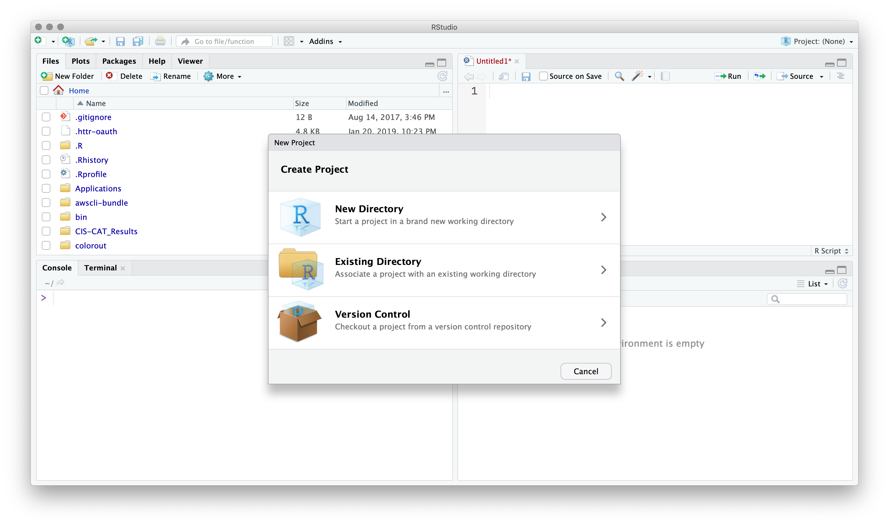
```
---
class: clear

If you open (double click) a project, .mono[RStudio] opens .mono[R] in that location.

```{R, pic_rstudio_projects3, echo = F}
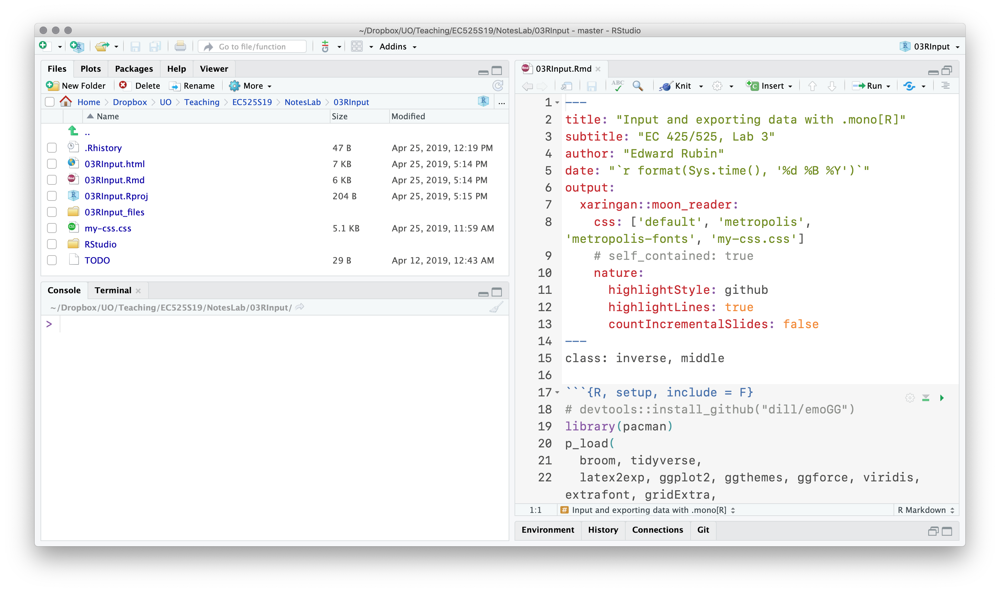
```
---
count: false
class: clear

.mono[RStudio] will 'load' your previous setup (pane setup, scripts, *etc.*).

```{R, pic_rstudio_projects3b, echo = F}

```
---
layout: true
# .mono[R] and .mono[RStudio]
## Projects

---

.hi-purple[Without a project], you will need to define long file paths that you'll need to keep updating as folder names/locations change.

--

`dir_class <- "/Users/edwardarubin/Dropbox/UO/Teaching/EC525S19/"`
<br>`dir_labs <- paste0(dir_class, "NotesLab/")`
<br>`dir_lab03 <- paste0(dir_labs, "03RInput/")`
<br>`sample_df <- read.csv(paste0(dir_lab03, "sample.csv"))`

--

.hi-pink[With a project], .mono[R] automatically references the project's folder.

`sample_df <- read.csv("sample.csv")`

--

.note[Double-plus bonus] The [`here`](https://github.com/r-lib/here) package extends projects' reproducibility.

---
layout: true
# Data i/o

---
class: inverse, middle

---
name: reading

## Reading files

Projects solve the hardest part of data input/output in .mono[R], _i.e._, navigating your computer's file structure.

.note[Steps to read in a file]

1. Figure out your .hi-slate[file's location] *relative to your project's location*.

1. .hi-slate[Find the function] that loads your files' file type.

1. .hi-slate[Load the file] with the function (using its location).
---
name: dir

```{R, create_samplecsv, include = F, cache = T}
p_load(babynames)
set.seed(12345)
n <- 15
write.csv(
  x = tibble(
    pid = str_pad(1:n, width = 3, side = "left", pad = 0),
    age = sample(x = 10:90, size = n, replace = T),
    first_name = c("Donald", sample(filter(babynames, between(year, 1990, 2000) & prop > 0.01)$name, size = n-1, replace = T)) %>% sample(size = n),
    is_orange = first_name == "Donald"
  ),
  file = "sample.csv",
  row.names = F
)
```

## Reading CSVs

We can check the files in the current (or any) directory with the `dir()`.

--

```{R, ex_dir}
dir()
```

Our current directory has the CSV `sample.csv` that I want to load.

---
name: read.csv

## Reading CSVs

.mono[R]'s base function for reading CSVs is `read.csv(file)`.

You feed `read.csv()` the directory and name of the CSV..super[.pink[†]]

.footnote[.pink[†] There are many other optional arguments, _e.g._, whether variables are named, variable types, *etc.*]

```{R, ex_read.csv}
read.csv("sample.csv") %>% head(4)
```

`read.csv()` returns a `data.frame` with the CSV's contents.

---
name: read_csv

## Reading CSVs

The Hadleyverse (technically, the `tidyverse` package) contains a package called `readr`, which contains the `read_csv()` function.

`read_csv()` is pretty fast, guesses variable well, and returns a `tibble`..super[.pink[†]]

.footnote[.pink[†] More speed: `fread()` from `data.table`. Notice `read.csv()` to `read_csv()` give `pid` differing classes.]

```{R, ex_read_csv}
p_load(tidyverse)
read_csv("sample.csv") %>% head(3)
```
---
name: read_other

## Reading other file types

If you've got a file, chances are .mono[R] can read it.

- Stata files: `read_dta` in `haven`

- SAS files: `read_sas` in `haven`

- Fixed-width files: `read_fwf()` in `readr` (also: `iotools`)

- Excel files: `read_excel()` in `readxl`

- Raster files: `raster()` in `raster`

- Shapefiles: `st_read()` in `sf`

---
name: write

## Writing

If .mono[R] can read it, then .mono[R] can write it.

Generally, there is a `write` or `save` function for each `read` function.

```{R, ex_write_csv, eval = F}
# Read 'sample.csv'
sample_df <- read_csv("sample.csv")
# Write sample_df to 'sample_copy.csv'
write_csv(
  x = sample_df,
  file = "sample_copy.csv"
)
```
---
name: rds

## RDS files

While CSVs can be nice—they are readable without loading into a statistical program—when they get big, they can be slow and inefficient.

.note[Enter] RDS files, .mono[R]'s compressed, faster answer.

The base functions `readRDS()` and `saveRDS()` read and save RDS files.

`readr` offers `read_rds()` and `write_rds()` for more standard naming.

```{R, ex_rds, eval = F}
# Write sample_df to 'sample.rds'
write_rds(x = sample_df, path = "sample.rds")
# Read 'sample.rds'
sample_df <- read_rds("sample.rds")
```
---
layout: false
name: resources

# Additional resources

More resources related to today's materials.

1. .mono[RStudio]'s [cheatsheet for .mono[RStudio]](https://www.rstudio.com/wp-content/uploads/2016/01/rstudio-IDE-cheatsheet.pdf)
1. [Many other cheatsheets](https://www.rstudio.com/resources/cheatsheets/) from .mono[RStudio]

---
layout: false

# Table of contents

.pull-left[.hi-slate[Data, .mono[R], and .mono[RStudio]]
.smaller[
1. [Schedule](#schedule)
1. [Review](#review)
1. [.mono[RStudio] features](#features)
1. [Best practices](#best)
1. [Projects](#projects)
1. [Data i/o](#reading)
  - [Reading files](#reading)
  - [`dir()`](#dir)
  - [`read.csv()`](#read.csv)
  - [`read_csv()`](#read_csv)
  - [Other file types](#read_other)
  - [Writing (output)](#write)
  - [RDS files](#rds)
1. [More resources](#resources)
]]

---
exclude: true

```{R, generate pdfs, include = F, eval = T}
source("../../ScriptsR/unpause.R")
unpause("03RInput.Rmd", ".", T, T)
```
