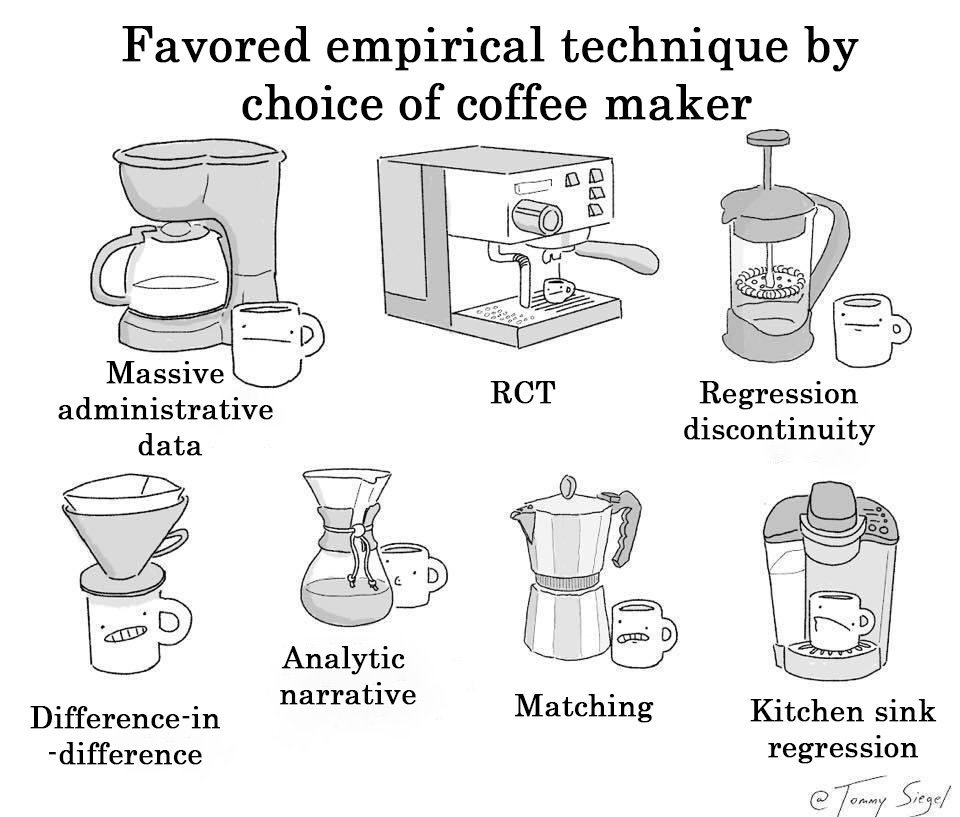

class: inverse, middle

```{R, setup, include = F}
# devtools::install_github("dill/emoGG")
library(pacman)
p_load(
  broom, tidyverse,
  latex2exp, ggplot2, ggthemes, ggforce, viridis, extrafont, gridExtra,
  kableExtra, snakecase, janitor,
  data.table, dplyr, estimatr,
  lubridate, knitr, parallel,
  lfe,
  here, magrittr
)
# Define pink color
red_pink <- "#e64173"
turquoise <- "#20B2AA"
orange <- "#FFA500"
red <- "#fb6107"
blue <- "#3b3b9a"
green <- "#8bb174"
grey_light <- "grey70"
grey_mid <- "grey50"
grey_dark <- "grey20"
purple <- "#6A5ACD"
slate <- "#314f4f"
# Dark slate grey: #314f4f
# Knitr options
opts_chunk$set(
  comment = "#>",
  fig.align = "center",
  fig.height = 7,
  fig.width = 10.5,
  warning = F,
  message = F
)
opts_chunk$set(dev = "svg")
options(device = function(file, width, height) {
  svg(tempfile(), width = width, height = height)
})
options(knitr.table.format = "html")
```

# Prologue

---
name: schedule

# Schedule

## Last time

1. .mono[RStudio] basics
2. Getting data in and out of .mono[R].

## Today

Regression!
---
name: review

# Review

## Data i/o

`readr` and `haven` have you covered for most of your i/o needs.

--

## Best practices

1. Write code in .mono[R] scripts. Troubleshoot in .mono[RStudio]. Then run the scripts.
1. Comment your code. (`# This is a comment`)
1. Name objects and variables with intelligible, standardized names.
  - .hi-purple[BAD] `ALLCARS`, `Vl123a8`, `a.fun`, `cens.12931`, `cens.12933`
  - .hi-pink[GOOD] `unique_cars`, `health_df`, `sim_fun`, `is_female`, `age`
1. Set seeds when generating randomness, _e.g._, `set.seed(123)`.
1. Parallelize when possible. (Packages: `parallel`, `purrr`, `foreach`, *etc.*)
1. Use projects in .mono[RStudio] (next). And organize your projects.
---
name: reg
class: inverse, middle
# Regression in .mono[R]
---
name: comics
class: clear, middle, center

```{R, coffee-econ, echo = F, out.width = "85%"}

```
---
class: clear, middle, center

```{R, coffee-original, echo = F, out.width = "85%"}

```
---
class: clear, middle

.b[Original credit]  Tommy Siegel [@TommySiegel](https://twitter.com/TommySiegel)

.b[Econ update] David Clingingsmith [@dclingi](https://twitter.com/dclingi)


---
layout: true
# Regression in .mono[R]

---
name: lm
## The default option: `lm()`

.mono[R]'s `base`.super[.pink[†]] option for estimating .hi[l]inear regression .hi[m]odels is `lm()`.

.footnote[.pink[†] `base` is .mono[R]'s basic (default) package—loaded on opening. <br>.pink[††] You can remove the intercept by adding `-1` into the formula, _e.g._, `lm(y ~ -1 + x)`.]

--

You use a formula to specify your linear regression model in `lm()`, _e.g._,

`lm(y ~ x)`
- Estimates $y_i = \beta_0 + \beta_1 x_i + u_i$ (.mono[R] automatically includes an intercept).super[.pink[††]]
- using the data stored in the objects `y` and `x`.

--

`lm(y ~ x, data = amazing_df)`
- Estimates $y_i = \beta_0 + \beta_1 x_i + u_i$
- using the variables (columns) `y` and `x` from the object `amazing_df`.
---
## More `lm()`

Need include more variables? Easy.

`lm(y ~ x1 + x2 + x3, data = some_df)`
- Estimates $y_i = \beta_0 + \beta_1 x_{1i} + \beta_2 x_{2i} + \beta_3 x_{3i} + u_i$
- referencing the object `some_df` for the named variables.

---
## Even more `lm()`

Do you want to transform/interact variables? Also easy: use `I()`.

`lm(y ~ x1 + x2 + I(x1^2) + I(x2^2) + I(x1*x2), data = poly_df)`
- Estimates $y_i = \beta_0 + \beta_1 x_{1i} + \beta_2 x_{2i} + \beta_3 x_{1i}^2 + \beta_4 x_{2i}^2 + \beta_5 x_{1i} x_{2i} + u_i$
- using variables named in object `poly_df`
- or created via `I()`

--

.note[Note] The following are equivalent
- `lm(y ~ x1 + x2 + I(x1*x2))`
- `lm(y ~ x1 + x2 + x1:x2)`
- `lm(y ~ x1*x2)`


---
name: transformations
## Transforming variables with `lm()`

Notice that in our call

`lm(y ~ x1 + x2 + I(x1^2) + I(x2^2) + I(x1*x2), data = poly_df)`

we did not need to create $x_1^2$, $x_2^2$, and $x_1\times x_2$ in the dataset.

.mono[R] will do the calculation (as long as `x1` and `x2` exist somewhere).

--

This is true for any transformation of variables/objects.

- Math./stat. transformations: `I(x^2)`, `I(x/3)`, `I((x - mean(x))/sd(x))`
- Log/exponential transformations: `log(x)`, `exp(x)`
- Indicators: `I(x < 100)`, `I(x == "Oregon")`
---
name: lalonde
## Need data

Before we can go any further, we need data.

--

Let's use data from .hi[[LaLonde (1986)](http://people.hbs.edu/nashraf/LaLonde_1986.pdf)].

This (famous) paper compared experimental and non-experimental estimates of the effect of a randomized jobs program called the National Supported Work Demonstration (NSW).

--

The data are [available online](http://users.nber.org/~rdehejia/data/nswdata3.html) as a `.dta` file.

```{R, load-lalonde}
# Load the 'haven' package
p_load(haven)
# Load treatment data
lalonde_df <- read_dta("http://users.nber.org/~rdehejia/data/nsw.dta")
```
---
layout: false
class: clear, center, middle

```{R, view-lalonde, echo = F, eval = T}
DT::datatable(
  lalonde_df[,2:6],
  fillContainer = FALSE,
  options = list(pageLength = 7)
)
```
---
layout: false
class: clear, center, middle

```{R, view-lalonde2, echo = F, eval = T}
DT::datatable(
  lalonde_df[,7:10],
  fillContainer = FALSE,
  options = list(pageLength = 7)
)
```
---
layout: true
# Regression in .mono[R]

---
## Output from `lm()`

Back to `lm()`.

--
The information that `lm()` prints to screen is underwhelming.

```{R, ex-lm-print}
lm(re78 ~ treat, data = lalonde_df)
```

--

But there's a lot more under the hood.
---
## Hidden information

Let's save the output of our call to `lm()`.

--

```{R, ex-lm}
est_lalonde <- lm(re78 ~ treat, data = lalonde_df)
```

--

What .hi-slate[class] is `est_lalonde`?

--

```{R, class-lm}
est_lalonde %>% class()
```

which means there's probably a lot more going on than what printed.
---

Does it have .hi-slate[names]?

--

```{R, names-lm}
est_lalonde %>% names()
```

--

Can we .hi-slate[tidy] it?

--

```{R, tidy-lm}
est_lalonde %>% tidy()
```
---
layout: false
class: clear, middle

You'll generally see folks take the `summary()` of an `lm` object.

---
class: clear

```{R, summary-lm}
est_lalonde %>% summary()
```
---
layout: true
# Regression in .mono[R]

---
## `summary()`

Interestingly, `summary()` contains additional information.

```{R, compare-names-lm}
est_lalonde %>% names()
```

```{R, compare-summary-lm}
est_lalonde %>% summary() %>% names()
```
---
## `tidy()`

That said, `summary()`'s output is a bit overwhelming.

--

As we saw, the output from `tidy()` contained everything we generally want.

```{R, tidy-again}
est_lalonde %>% tidy()
```
---
## Non-standard standard errors

.qa[Q] Which estimator does `lm()` use for its standard errors?

--

.qa[A] Spherical/classical/homoskedastic.

--

.qa[Q] What if we want something else?

---
name: outside
## Outside options

.qa[Q] What if we want something else?

.qa[A] This is why you'll end up replacing `lm()` with one of two different linear-regression packages.

--

1. `felm()` from the [`lfe`](https://cran.r-project.org/web/packages/lfe/index.html) package is incredibly fast with high-dimensional fixed effects, easily implements IV/2SLS, and offers heteroskedasticity- and cluster-robust standard errors estimators.

--

1. `lm_robust()` from the [`estimatr`](https://declaredesign.org/r/estimatr/) package is fast, has a sister function named `iv_robust()` for IV/2SLS, and allows for a wide range of heteroskedasticity- and cluster-robust standard error estimators.

--

Both packages maintain the same `y ~ x` formula (plus additional features).
---
name: estimatr
## `estimatr`

Let's check out `lm_robust()` from `estimatr`.

--

We still need input a `formula` and `data`, but now we have options for the type of standard error estimator (`se_type`).

--

> The sort of standard error sought. If `clusters` is not specified the options are "HC0", "HC1" (or "stata", the equivalent), "HC2" (default), "HC3", or "classical". If `clusters` is specified the options are "CR0", "CR2" (default), or "stata". Can also specify "none", which may speed up estimation of the coefficients.

.grey-light[`estimatr` documentation for `lm_robust()`]
---
## `estimatr`

Now for the magic.

```{R, ex-estimatr}
# Load 'estimatr' package
p_load(estimatr)
# Estimate
robust_lalonde <- lm_robust(re78 ~ treat, data = lalonde_df)
# Tidy results
tidy(robust_lalonde)
```
---
## Prediction

So what if we want to get the predictions from a regression?

--

You have *a lot* of options. Here are two (for different scenarios).

--

.note[Scenario 1] You want predictions for the original $X$,

```{R, pred1, eval = F}
robust_lalonde$fitted.values
```

--

.note[Scenario 2] You want predictions (with prediction intervals) for new data,

```{R, pred2, eval = F}
predict(
  object = robust_lalonde,
  newdata = new_df,
  interval = "prediction"
)
```
---
name: logit
## Other regressions

Ordinary least squares (OLS) is only one of many types of regressions.

If you can run one regression in .mono[R], you can run any regression in .mono[R]..super[.pink[†]]

.footnote[.pink[†] This is not to say that you should or that you'll know what you're doing.
<br>.pink[††] Logit models are a popular nonlinear regression model for binary outcomes.]

--

_E.g._, logistic regression ("logit").super[.pink[††]] in .mono[R] uses the `glm()` function.

To estimate the probability of treatment on observables in LaLonde's data,

```{R, ex-glm, eval = F}
glm(
  treat ~ age + education + black + hispanic + married,
* family = "binomial",
  data = lalonde_df
)
```
---
layout: false
class: clear

```{R, ex-logit, eval = T}
# Estimate logit model
trt_logit <- glm(
  treat ~ age + education + black + hispanic + married,
  family = "binomial",
  data = lalonde_df
)
# Tidy logit results
trt_logit %>% tidy()
```

(Not too surprising, since treatment was randomly assigned.)
---
layout: false
name: resources

# Additional resources

## There's more

General resources

- The [`swirl` package](https://swirlstats.com/) will teach you .mono[R] in .mono[R].

Regression with `estimatr`

- Getting started with `estimatr`
- A [cheatsheet](https://github.com/rstudio/cheatsheets/raw/master/estimatr.pdf) for `estimatr`

Logit models (logistic regression)

- [Examples and discussion](https://stats.idre.ucla.edu/r/dae/logit-regression/)
- [Interpretting results from logit models](https://stats.idre.ucla.edu/other/mult-pkg/faq/general/faq-how-do-i-interpret-odds-ratios-in-logistic-regression/)
---
layout: false

# Table of contents

.pull-left[
### Regression in .mono[R]
.smaller[
1. [Schedule](#schedule)
1. [Review](#review)
1. [Regression](#reg)
  - [Coffee comics](#comics)
  - [The `base` option: `lm`](#lm)
  - [Transformations](#transformations)
  - [LaLonde (1986)](#lalonde)
  - [Other options](#outside)
  - [`estimatr` and `lm_robust()`](#estimatr)
  - [Prediction](#predict)
  - [Logistic regression](#logit)
1. [More resources](#resources)
]]

---
exclude: true

```{R, generate pdfs, include = F, eval = T}
source("../../ScriptsR/unpause.R")
unpause("04RReg.Rmd", ".", T, T)
```
