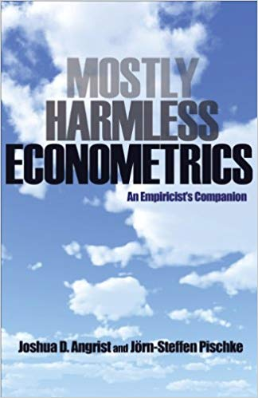
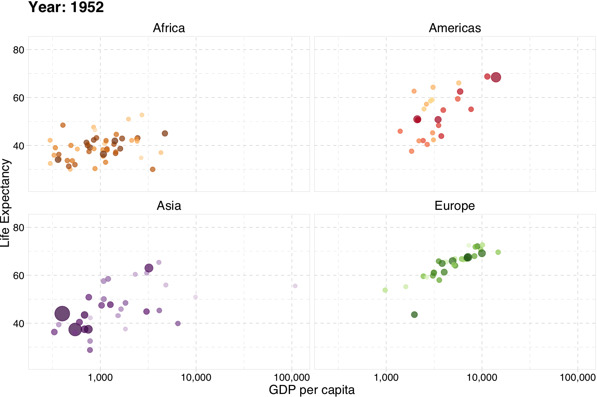

class: inverse, middle

```{R, setup, include = F}
# devtools::install_github("dill/emoGG")
library(pacman)
p_load(
  broom, tidyverse,
  latex2exp, ggplot2, ggthemes, ggforce, viridis, extrafont, gridExtra,
  kableExtra, snakecase, janitor,
  data.table, dplyr, estimatr,
  lubridate, knitr, parallel,
  lfe,
  here, magrittr
)
# Define pink color
red_pink <- "#e64173"
turquoise <- "#20B2AA"
orange <- "#FFA500"
red <- "#fb6107"
blue <- "#2b59c3"
green <- "#8bb174"
grey_light <- "grey70"
grey_mid <- "grey50"
grey_dark <- "grey20"
purple <- "#6A5ACD"
slate <- "#314f4f"
# Dark slate grey: #314f4f
# Knitr options
opts_chunk$set(
  comment = "#>",
  fig.align = "center",
  fig.height = 7,
  fig.width = 10.5,
  warning = F,
  message = F
)
opts_chunk$set(dev = "svg")
options(device = function(file, width, height) {
  svg(tempfile(), width = width, height = height)
})
options(crayon.enabled = F)
options(knitr.table.format = "html")
# A blank theme for ggplot
theme_empty <- theme_bw() + theme(
  line = element_blank(),
  rect = element_blank(),
  strip.text = element_blank(),
  axis.text = element_blank(),
  plot.title = element_blank(),
  axis.title = element_blank(),
  plot.margin = structure(c(0, 0, -0.5, -1), unit = "lines", valid.unit = 3L, class = "unit"),
  legend.position = "none"
)
theme_simple <- theme_bw() + theme(
  line = element_blank(),
  panel.grid = element_blank(),
  rect = element_blank(),
  strip.text = element_blank(),
  axis.text.x = element_text(size = 18, family = "STIXGeneral"),
  axis.text.y = element_blank(),
  axis.ticks = element_blank(),
  plot.title = element_blank(),
  axis.title = element_blank(),
  # plot.margin = structure(c(0, 0, -1, -1), unit = "lines", valid.unit = 3L, class = "unit"),
  legend.position = "none"
)
theme_axes_math <- theme_void() + theme(
  text = element_text(family = "MathJax_Math"),
  axis.title = element_text(size = 22),
  axis.title.x = element_text(hjust = .95, margin = margin(0.15, 0, 0, 0, unit = "lines")),
  axis.title.y = element_text(vjust = .95, margin = margin(0, 0.15, 0, 0, unit = "lines")),
  axis.line = element_line(
    color = "grey70",
    size = 0.25,
    arrow = arrow(angle = 30, length = unit(0.15, "inches")
  )),
  plot.margin = structure(c(1, 0, 1, 0), unit = "lines", valid.unit = 3L, class = "unit"),
  legend.position = "none"
)
theme_axes_serif <- theme_void() + theme(
  text = element_text(family = "MathJax_Main"),
  axis.title = element_text(size = 22),
  axis.title.x = element_text(hjust = .95, margin = margin(0.15, 0, 0, 0, unit = "lines")),
  axis.title.y = element_text(vjust = .95, margin = margin(0, 0.15, 0, 0, unit = "lines")),
  axis.line = element_line(
    color = "grey70",
    size = 0.25,
    arrow = arrow(angle = 30, length = unit(0.15, "inches")
  )),
  plot.margin = structure(c(1, 0, 1, 0), unit = "lines", valid.unit = 3L, class = "unit"),
  legend.position = "none"
)
theme_axes <- theme_void() + theme(
  text = element_text(family = "Fira Sans Book"),
  axis.title = element_text(size = 18),
  axis.title.x = element_text(hjust = .95, margin = margin(0.15, 0, 0, 0, unit = "lines")),
  axis.title.y = element_text(vjust = .95, margin = margin(0, 0.15, 0, 0, unit = "lines")),
  axis.line = element_line(
    color = grey_light,
    size = 0.25,
    arrow = arrow(angle = 30, length = unit(0.15, "inches")
  )),
  plot.margin = structure(c(1, 0, 1, 0), unit = "lines", valid.unit = 3L, class = "unit"),
  legend.position = "none"
)
theme_set(theme_gray(base_size = 20))
# Column names for regression results
reg_columns <- c("Term", "Est.", "S.E.", "t stat.", "p-Value")
# Function for formatting p values
format_pvi <- function(pv) {
  return(ifelse(
    pv < 0.0001,
    "<0.0001",
    round(pv, 4) %>% format(scientific = F)
  ))
}
format_pv <- function(pvs) lapply(X = pvs, FUN = format_pvi) %>% unlist()
# Tidy regression results table
tidy_table <- function(x, terms, highlight_row = 1, highlight_color = "black", highlight_bold = T, digits = c(NA, 3, 3, 2, 5), title = NULL) {
  x %>%
    tidy() %>%
    select(1:5) %>%
    mutate(
      term = terms,
      p.value = p.value %>% format_pv()
    ) %>%
    kable(
      col.names = reg_columns,
      escape = F,
      digits = digits,
      caption = title
    ) %>%
    kable_styling(font_size = 20) %>%
    row_spec(1:nrow(tidy(x)), background = "white") %>%
    row_spec(highlight_row, bold = highlight_bold, color = highlight_color)
}
```

# Prologue

---
name: schedule

# Schedule

## Today

- Research basics: *Why are we here?* .grey-vlight[*MHE*: Preface & Ch. 1]
- Our class: *What are we doing?*
- .mono[R]: Part of our *how* in this class: Install and basics.

## Upcoming

- Learn more .mono[R].
- Review metrics and building intution for causality and inference.
- Build momentum.

## Long run

.hi[Goal:] Deepen understandings/intuitions for causality and inference.
---
layout: true
# Research
---
name: why

## Why are we here?


- .hi[Econ. research]
.hi[:] Understand human, social, and/or economic behaviors.


- .hi[PhD]
.hi[:] Learn methods, tools, skills, and intution required for research.


- .hi[(Applied) econometrics]
.hi[:] Build a toolbox of .pink[*empirical* methods, tools, and skills] to that combine data and statistical insights to test and/or measure theories and policies.


- .hi[You]
.hi[:] You should be thinking about this question throughout your program/work/life.
 .hi-purple[Self awareness and mental health are important.]
---

## This class

For many of people, .hi[this course marks a big shift] in how school works.

- You don't have a metrics qualifying exam.
- Grades are not super important.


The material and tools are pivotal for **a lot** of what you will do in the future.


.hi[Take responsibility for your education and career.]

- Commit to spending the necessary time.
- Be proactive and curious.
- Go down rabbit holes.
- Ask questions.
- Learn.


---

## What are we doing?

.hi[Q] What is the difference between *econometrics* and *data science*?
<br>.hi[Q].sub[.pink[v2]] Is there anything special about *econometrics*?


.hi[A].pink[.sub[1/∞]] Causality.<sup>.smallest[😸]</sup>

.footnote[
😸 Sources for this Q and A: [Dan Hammer](https://www.danham.me/r/about.html) and [Max Auffhammer](https://www.auffhammer.com/).
]


***Note:*** There are large parts of econometrics that focus on *prediction* rather than *causality* (*e.g.*, forecasting—see [Jeremy Piger](https://pages.uoregon.edu/jpiger/)). However, causality plays a *huge* role in modern applied econometrics (esp. in micro).

---
layout: false
class: clear

Toward this end—causality—we will use two books (favoring *MHE*).

.pull-left[
.hi-pink[Mostly Harmless Econometrics]
<br>*Angrist and Pischke, 2008*
```{R, cover_mhe, out.width = "50%", echo = F}

```
]
.pull-right[
.hi-slate[Econometric Analysis]
<br>*Greene, 2018*
```{R, cover_greene, out.width = "60%", echo = F}
include_graphics("cover_greene.jpg")
```
]


.pull-left[Buy now. .hi[Read this book.]<br>The standard for causal metrics.<br>.pink[*MHE*]]
.pull-right[More of an reference/encyclopedia.<br>Classic metrics theory.<br>.slate[*Greene*]]
---
layout: true

# Causal research
---

## Motivation

> First, we believe that .pink[empirical research is most valuable when it uses data to answer specific causal questions, *as if* in a randomized clinical trial.] This view shapes our approach to most research questions. In the absence of a real experiment, we look for well-controlled comparisons and/or natural quasi-experiments. Of course, some quasi-experimental research designs are more convincing than others, but .purple[the econometric methods used in these studies are almost always fairly simple].

*Mostly Harmless Econometrics*, p. xii (color added)


.pink[1\. This ideology inherently compares research to "gold-standard" RCTs.]
<br>.purple[2\. The methods are usually (relatively) straightforward (after training).]
---
name: faqs

## Angrist and Pischke's FAQs<sup>.pink[†]</sup>

.footnote[
.pink[†] See *MHE*, chapter 1.
.pink[††] Credit for these questions goes to [Reed Walker](https://w-reed-walker.com/).
]

1. What is the .hi[causal relationship of interest]?

2. How would an .hi[ideal experiment] capture this causal effect of interest?

3. What is your .hi[identification strategy]?

4. What is your .hi[mode of inference]?


***Note:*** Other questions also matter for developing quality research, *e.g.*,<sup>.pink[††]</sup>

- Why is your question .hi[important/interesting]?
- Why is the .hi[current literature] lacking or nonexistant?
- How do you propose to .hi[advance the literature]?
---
name: faq1

## FAQ.sub[1]: What is the causal relationship of interest?

Descriptive exercises can be [very interesting and important](https://www.opportunityatlas.org/), but in modern applied econometrics, .hi-purple[causality is king].

**Why?**


- Causal relationships directly .hi-purple[test theories] of how the world works.

- Causal relationships provide us with .hi-purple[*counterfactuals*]—how the world would have looked with different sets of policies/circumstances.


🚧 If you can't clearly and succinctly name the causal relationship of interest, then you may not actually have a research project.
---

## FAQ.sub[1]: What is the causal relationship of interest?

*Some classic examples...*

**Labor and Education**<br>How does an additional year of schooling affect wages?

**Political economy and Development**<br>How do democratic institutions affect economic development?

**Environment and Urban**<br>Do the poor receive substantive benefits from environmental clean ups?

**Health, Crime, and Law**<br>Do gun-control laws actually reduce gun violence?

---
name: faq2

## FAQ.sub[2]: What is the ideal experiment for this setting?

Describing the *ideal experiment* helps us formulate

- the .pink[exact causal question(s)]

- the dimensions we want to .pink[manipulate]

- the factors we need to .pink[hold constant]


🚧 These *ideal experiments* are generally hypothetical, but if you can't describe the ideal, it will probably be hard to come up with data and plausible research designs in real life.


Angrist and Pischke call questions without ideal experiments *fundamentally unanswerable questions* (FUQs).
---

## FAQ.sub[2]: What is the ideal experiment for this setting?

*Examples of potentially answerable questions...*

- **The effect of education on wages:** Randomize scholarships or incentives to remain in school.
- **Democracy and development:** Arbitrarily assign institutional types to countries as they receive independence.
- **Environmental cleanups:** Ask EPA to randomly clean toxic sites.
- **Gun laws:** Randomly assign gun restrictions to jurisdictions.


*Examples of challenging questions to answer (potentially unanswerable?)...*

- How does gender affect eventual career paths?
- What role does race play in one's wages?

---

## FAQ.sub[2]: What is the ideal experiment for this setting?

Sometimes even simple-sounding policy questions turn out to be fundamentally unanswerable.


*Example of a fundamentally unanswerable question*:
> Do children perform better by starting school at an older age?


**Proposed ideal experiment**

1. Randomize kids to start 1.super[st] grade at age 6 or 7.
2. Compare 2.super[nd] grade test scores.


.hi[Problem]
 Kids who started later are older in 2.super[nd] grade. Older kids do better. Do we want the effect of starting later or just being older?

---
count: false

## FAQ.sub[2]: What is the ideal experiment for this setting?

Sometimes even simple-sounding policy questions turn out to be fundamentally unanswerable.

*Example of a fundamentally unanswerable question*:
> Do children perform better by starting school at an older age?

**Proposed ideal experiment.sub[2.0]**

1. Randomize kids to start 1.super[st] grade at age 6 or 7.
2. .purple[Control for age.] Compare test scores when kids are age 8.


.hi[Problem.sub[2.0]]
 The two groups will have been in school for different numbers of years (1 vs. 2). More school should mean better scores.
---
count: false

## FAQ.sub[2]: What is the ideal experiment for this setting?

Sometimes even simple-sounding policy questions turn out to be fundamentally unanswerable.

*Example of a fundamentally unanswerable question*:
> Do children perform better by starting school at an older age?

.hi[Central problem:] Mechanical links between ages and time in school.

.center[(Start Age) = (Current Age) – (Time in School)]

No experiment can separate these effects (for school-age children).
---
name: faq3

## FAQ.sub[3]: What's your identification strategy?

This question<sup>✋</sup> describes how you plan to recover/observe *as good as random* assignment of your variable of interest (approximating your ideal experiment) .hi-pink[in real life].

.footnote[✋ You will hear this question asked *a lot*.]

***Examples***
- Compulsory school-attendance laws *interacted with* quarter of birth
- Vietnam War draft
- Thresholds for the Clean Air Act violations
- Notches in income-tax policies
- Judge assignments
- Randomly assigned characteristics on résumés

---

## FAQ.sub[3]: What's your identification strategy?

*A brief history*

The term "identification strategy" goes back to Angrist and Krueger (1991).

However, the comparison of *ideal* and *natural* experiments goes back much farther to Haavelmo (1944)...

---

> A design of experiments... is an essential appendix to any quantitative theory. And .orange[we usually have some such experiment in mind when we construct the theories], although-unfortunately-most economists do not describe their design of experiments explicitly. If they did, they would see that the experiments they have in mind may be grouped into two different classes, namely, (1) .pink[experiments that we should like to make to see if certain real economic phenomena—when artificially isolated from "other influences"]—would verify certain hypotheses, and (2) .purple[the stream of experiments that Nature is steadily turning out from her own enormous laboratory], and which we merely watch as passive observers. In both cases the aim of the theory is the same, to become master of the happenings of real life.

*Haavelmo, 1944* (color added)
---
name: faq4

## FAQ.sub[4]: What is your mode of inference?

Historically, inference—standard errors, confidence intervals, hypothesis tests, *etc.*—has received much less attention than point estimates. It's becoming more important (more than an afterthought).

- Which .hi[population] does your sample represent?

- How much .hi[noise] (error) exists in your estimator (and estimates)?

- How much .hi[variation] do you actually have in your variable of interest?


Without careful inference, we don't know the difference between
- 21% ± 2.3%
- 21% ± 20.3%
---
layout: false
class: middle, inverse

# Our class
---
name: syllabus

# Our class
## Mini-syllabus

.hi[Class] Attend/participate. Read assigned readings—especially papers.

.hi[Lab] Practice applying our in-class content in .mono[R] with Jenni Putz. Attend.

.hi[Problem sets] 2–4 problem sets mixing theory and applications in .mono[R].

.hi[Other grades] The current plan: Two take-home exams.


***Note:*** This class is under development.
- .hi-slate[Challenge:] Less structure.
- .hi-slate[Benefit:] You get more say in what we cover/do. Participate!

---
layout: false
class: middle, inverse

# .mono[R]
---
layout: true

# .mono[R] basics
---
name: basics

## What is it?

The [.mono[R] project website](https://www.r-project.org):

> R is a free software environment for statistical computing and graphics. It compiles and runs on a wide variety of UNIX platforms, Windows and MacOS.


What does that mean?

- .mono[R] was created for the statistical and graphical work required by econometrics.

- .mono[R] has a vibrant, thriving online community (*e.g.*, [Stack Overflow](https://stackoverflow.com/questions/tagged/r)).

- Plus it's __free__ and __open source__.

---

## Why are we using .mono[R]?

1\. .mono[R] is __free__ and __open source__—saving both you and the university 💰💵💰.

2\. _Related:_ Outside of a small group of economists, private- and public-sector __employers favor .mono[R]__ over .mono[Stata] and most competing softwares.

3\. .mono[R] is very __flexible and powerful__—adaptable to nearly any task, _e.g._, 'metrics, spatial data analysis, machine learning, web scraping, data cleaning, website building, teaching. [My website](https://edrub.in), the [TWEEDS website](https://tweeds.io), and these notes all came out of .mono[R].

---

```{R, statistical languages, echo = F, fig.height = 6, fig.width = 9, dev = "svg"}
# The popularity data
pop_df <- data.frame(
  lang = c("SQL", "Python", "R", "SAS", "Matlab", "SPSS", "Stata"),
  n_jobs = c(107130, 66976, 48772, 25644, 11464, 3717, 1624),
  free = c(T, T, T, F, F, F, F)
)
pop_df %<>% mutate(lang = lang %>% factor(ordered = T))
# Plot it
ggplot(data = pop_df, aes(x = lang, y = n_jobs, fill = free)) +
geom_col() +
geom_hline(yintercept = 0) +
aes(x = reorder(lang, -n_jobs), fill = reorder(free, -free)) +
xlab("Statistical language") +
scale_y_continuous(label = scales::comma) +
ylab("Number of jobs") +
ggtitle(
  "Comparing statistical languages",
  subtitle = "Number of job postings on Indeed.com, 2019/01/06"
) +
scale_fill_manual(
  "Free?",
  labels = c("True", "False"),
  values = c(red_pink, "darkslategray")
) +
theme_pander(base_size = 17) +
theme(legend.position = "bottom")
```

---

## Why are we using .mono[R]?

4\. _Related:_ .mono[R] imposes __no limitations__ on your amount of observations, variables, memory, or processing power. (I'm looking at __you__, .mono[Stata].)

5\. If you put in the work,<sup>.tiny[🖥️]</sup> you (and your students!) will come away with a __valuable and marketable__ tool.

.footnote[
🖥️: Learning .mono[R] definitely requires time and effort.
]

6\. I 💖 __.mono[R]__

---

.center[]
---
name: install

## The install

Installing .mono[R] is fairly straightfoward, but it occasionally involves challenges for older computers.

.hi-slate[Step 1:] Download ([r-project.org](https://www.r-project.org/)) and install .mono[R] .purple[for your operating system].

.hi-slate[Step 2:] Download ([rstudio.com](https://www.rstudio.com/products/rstudio/download/#download)) and install .mono[RStudio] .orange[Desktop] .purple[for your operating system].

[DataCamp](https://www.datacamp.com/community/tutorials/installing-R-windows-mac-ubuntu) has a nice tutorial on installing .mono[R] and .mono[RStudio] for Windows, Mac, and Linux operating systems.

---
name: fundamentals

## Fundamentals

Let's get started. There are a few principals to keep in mind with .mono[R]:


.more-left[1\. Everything is an __object__.]
.less-right[`foo`]

<br>


.more-left[2\. Every object has a __name__ and __value__.]
.less-right[`foo <- 2`]

<br>


.more-left[3\. You use __functions__ on these objects.]
.less-right[`mean(foo)`]

<br>


.more-left[4\. Functions come in __libraries__ (__packages__)]
.less-right[`library(dplyr)`]

<br>


.more-left[5\. .mono[R] will try to __help__ you.]
.less-right[`?dplyr`]

<br>


.more-left[6\. .mono[R] has its __quirks__.]
.less-right[`NA; error; warning`]

---

## Fundamentals of functions

Functions operate on objects, but they need some guidance—arguments.


***Example:*** `ex_fun(arg1, arg2, arg3)`


- Our function is named `ex_fun`.

- This function takes three arguments: `arg1`, `arg2`, `arg3`.

- You can tell .mono[R] which values to assign to which arguments:<br>`ex_fun(arg1 = 13, arg2 = 25, arg3 = 7)` (probably best practice)

- ... or .mono[R] will assign the values using the arguments' defined order:<br>`ex_fun(13, 25, 7)` (shorter/lazier but has the same result)

- You must assign a name to a function's outputted object (to keep it).
---

## Example function: `matrix`

We will need to create matrices in this class.

Enter: .mono[R]'s `matrix()` function!

---
layout: false
class: clear


.pull-left[
```{R, ex_matrix1}
# 3x2 matrix filled w/ zeros
matrix(
  data = 0, nrow = 3, ncol = 2
)
```
]
.pull-right[
```{R, ex_matrix2}
# 3x2 matrix filled w/ 1 to 6
matrix(
  data = 1:6, nrow = 3, ncol = 2
)
```
]

---
layout: false
class: clear

.pull-left[
```{R, ex_matrix3}
# 3x2 matrix filled w/ 1:6 by row
matrix(
  data = 1:6, nrow = 3, ncol = 2,
  byrow = T
)
```
]
.pull-right[
```{R, ex_matrix4}
# 3x2 matrix filled w/ 1:3
matrix(
  data = 1:3,
  nrow = 3, ncol = 2
)
```
]
.pull-left[
```{R, ex_matrix5}
# 3x2 matrix filled w/ 1:3
# Assigned to memory
our_matrix <- matrix(
  data = 1:3,
  nrow = 3, ncol = 2
)
```
]

---
layout: true

# .mono[R] basics

---

## Help and functions

.hi[Q] How do we know which arguments a function requires/accepts?


.hi[A] `?`
 Meaning you can type `?matrix` into your .mono[R] console to find the help file associated with the functions/objects named `matrix`.


.hi[Double bonus:] Use `??matrix` to perform a fuzzy search for the term `matrix` in all of the help files.

---

## Example function: `matrix`

.hi[Q] How do we know which arguments a function requires/accepts?

.hi[A.sub[2]] .mono[RStudio] will also try to help you.
- Type a name (_e.g._, `matrix`) into the console; .mono[RStudio] will show you some info about the function.
- After you type the name and parentheses (_e.g._, `matrix()`), press .mono[tab], and .mono[RStudio] will show you a list of arguments for the function.

---
layout: false
# Table of contents

.pull-left[
### Admin
.smallest[

1. [Schedule](#schedule)
1. [Mini-syllabus](#syllabus)
]

]

.pull-right[
### Research
.smallest[

1. [Why are we here?](#why)
1. [*MHE*'s FAQs](#faqs)
  1. [Question](#faq1)
  1. [Experiment](#faq2)
  1. [Identification](#faq3)
  1. [Inference](#faq4)
]

### .mono[R]
.smallest[

1. [Basics](#basics)
1. [Install](#install)
1. [Fundamentals](#fundamentals)
]

]
---
exclude: true

```{R, generate pdfs, include = F, eval = T}
source("../../ScriptsR/unpause.R")
```
